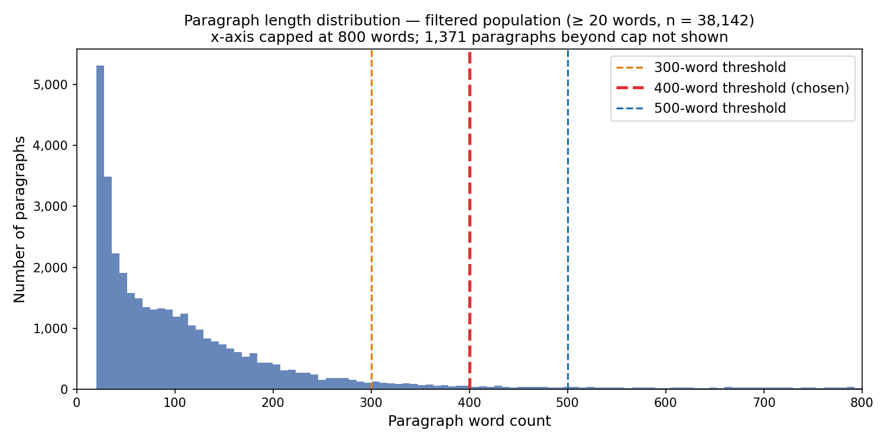

# Chunk Size Analysis

Paragraph boundaries defined by `\n\n` splits (mirrors pipeline.py).  
Chunk cap under analysis: **400 words**.

## 1. All Paragraphs (Raw Splits)

| Metric | Value |
| --- | --- |
| Total paragraphs | 103,309 |
| Mean | 146.4 |
| Median | 7.0 |
| Std dev | 1151.9 |
| Min | 1 |
| Max | 81,838 |
| 50th percentile | 7.0 |
| 75th percentile | 49.0 |
| 90th percentile | 149.0 |
| 95th percentile | 239.0 |
| 99th percentile | 2215.0 |
| % exceeding 400 words | 2.79% |

## 2. Pipeline-Relevant Paragraphs (≥ 20 Words)

The pipeline discards any paragraph shorter than 20 words downstream, so this is the population that actually matters for justifying the 400-word cap.

| Metric | Value |
| --- | --- |
| Total paragraphs | 38,142 |
| Mean | 389.3 |
| Median | 85.0 |
| Std dev | 1871.0 |
| Min | 20 |
| Max | 81,838 |
| 50th percentile | 85.0 |
| 75th percentile | 159.0 |
| 90th percentile | 304.0 |
| 95th percentile | 647.0 |
| 99th percentile | 10711.7 |
| % exceeding 400 words | 7.57% |

## 3. Very Long Paragraphs (> 3,000 Words)

**982** paragraphs exceed 3,000 words (0.95% of all paragraphs).  
These are likely parsing artifacts — SEC filings that lack double-newline breaks causing multiple paragraphs to merge into a single blob.

### Examples

**Example 1** (8,446 words)

> Risks Related to Our Indebtedness  We have a significant amount of debt and may incur significant additional debt, including secured debt, in the future, which could adversely affect our financial health and our ability to react to changes in our business. We have a significant amount of debt and ma …

**Example 2** (8,286 words)

> Risks Related to Our Indebtedness  We have a significant amount of debt and may incur significant additional debt, including secured debt, in the future, which could adversely affect our financial health and our ability to react to changes in our business. We have a significant amount of debt and ma …

**Example 3** (8,448 words)

> Risks Related to Our Indebtedness  We have a significant amount of debt and may incur significant additional debt, including secured debt, in the future, which could adversely affect our financial health and our ability to react to changes in our business. We have a significant amount of debt and ma …

## 4. Threshold Sensitivity (300 vs 400 vs 500)

Applied to the filtered population (38,142 paragraphs ≥ 20 words).  
Total chunks = paragraphs at or under threshold (1 chunk each) + paragraphs over threshold split into ⌈word_count / threshold⌉ chunks.

| Threshold | % exceeding | Total chunks |
| --- | --- | --- |
| 300 words | 10.14% | 75,600 |
| 400 words | 7.57% | 65,326 |
| 500 words | 6.30% | 59,449 |

## Distribution

Dashed red line = 400-word cap. Dotted orange line = 20-word pipeline floor.  
Display clipped at 1,200 words; long tail excluded for readability.

